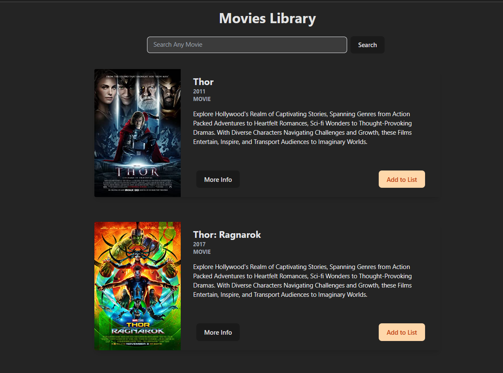
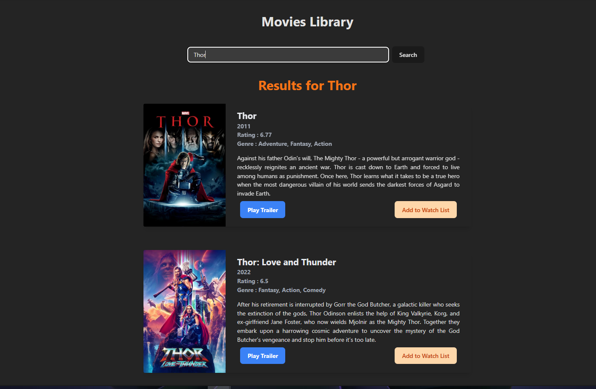
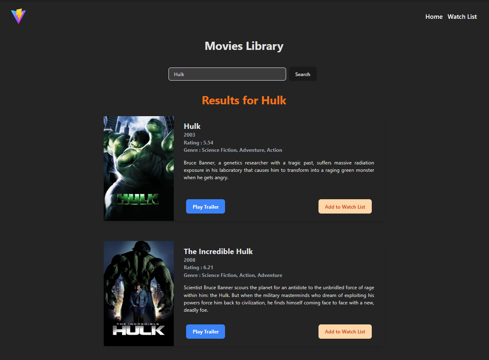
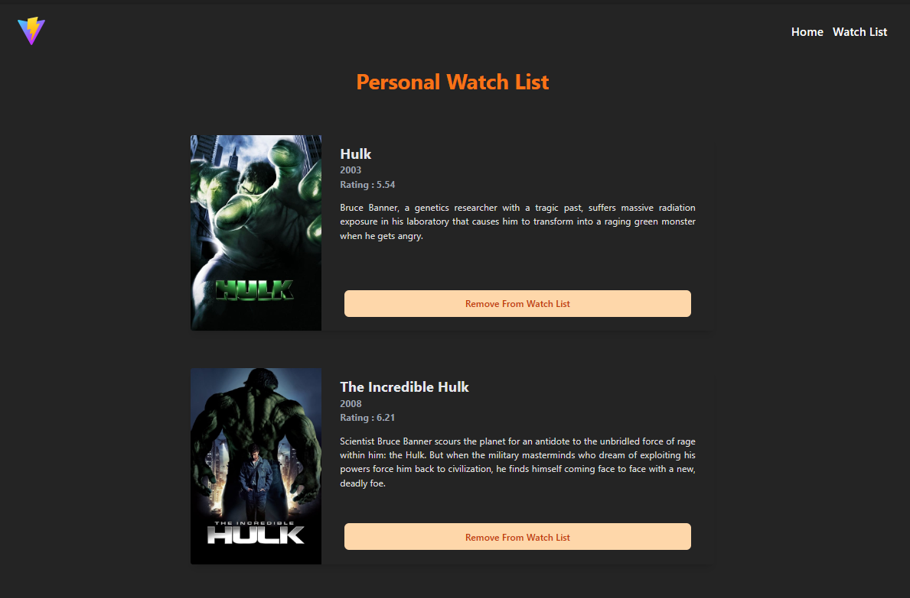

<font style="color:#fff; font-family: 'Bebas Neue'; 
font-size: 3.5ch">

# Movie Catalogue App

Search Movies from Movie API using ReactJS

<b> --> Visit This Website : </b> https://movies-catalogue-yhz.vercel.app/ <br>

Welcome to the Movies Catalogue React App! <br>
This Application allows Users to Browse and Search for Movies using Data Fetched from an API. <br>
The Movies are Presented in Beautiful Cards and Website is Completely Responsive for an Enhanced User Experience.

(OLD Version)

<br>
(Previous Version)

<br>
(Latest Version)

<br>
(WatchList)


## Table of Contents

- [Project](#project)
- [Features](#features)
- [Tools](#tools)
- [Installation](#installation)
- [API](#api)
- [Usage](#usage)
- [License](#license)

## Project

- This React Project is built using Tailwind CSS with Vite.
- To Create this Project, Follow Mentioned Steps <br>
  in the Official TailwindCSS Documentation,

--> https://tailwindcss.com/docs/guides/vite

## Features

- Fetches Movie Data from API.
- Displays Movies in Visually Appealing Cards.
- Responsive Design for Various Screen Sizes.
- Allows Users to,
  1.  Search for Movies
  2.  Play Trailer
  3.  Add to Watch List
  4.  Navigate using Navbar
  5.  Remove from Watch List

## Tools

- IDE : VS Code
- Framework : React
- Language : Javascript
- Styling : Tailwind CSS

## Installation

1. Clone the repository:

   ```bash
   git clone https://github.com/YHZ-EPIC/Movies_Catalogue.git
   ```

2. Navigate to the project directory:
   ```bash
   cd Movies_Catalogue
   ```
3. Install dependencies:
   ```bash
   npm install
   ```

## API

- **TMDB API** :
  TMDB API Provides access to an Immense Database of Movies and TV Shows.

- This API Provides the Following Information,

  1.  Titles
  2.  Poster
  3.  Release Dates
  4.  Synopsis
  5.  Genres
  6.  Trailer & so on...

- **API Key Required**: To use the TMDB API, you must obtain an API key by
  registering on the TMDB website. This key is necessary for authentication
  and access to the data.

- **Flexible Endpoints**: The API offers various endpoints to meet your needs,
  including Movie and TV Show details, Search Functionality, Trending Movies,
  Cast and Crew details and Genre information.

- **Rate Limiting**: TMDB API imposes rate limits to prevent misuse. These limits
  may vary depending on your subscription level, so it's essential to check
  the API documentation for current rate limit information.

## Usage

1. Obtain an API key from OMDb Movie API Provider and replace 'YOUR_API_KEY' <br>
   in the src/App.jsx file with your actual API key.

2. Start the development server:
   ```bash
   npm run dev
   ```
3. Hold Ctrl Key and Click on
   the localhost link generated on Terminal <br>
   which will open your Browser. You can now use the App.

## License

This project is licensed under the MIT License.

Feel free to reach out to us if you have any questions or suggestions. <br>

Enjoy using the Movie Catalogue React App ❤

</font>
