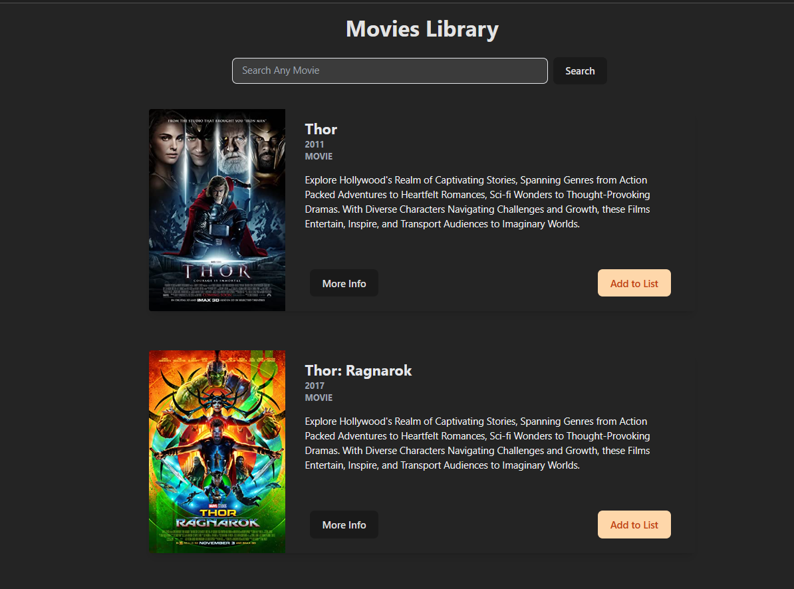

<font style="color:#fff; font-family: 'Bebas Neue'; 
font-size: 3.5ch">

# Movie Catalogue App

Search Movies from Movie API using ReactJS

<b> --> Visit This Website : </b> https://movies-catalogue-yhz.vercel.app/ <br>

Welcome to the Movies Catalogue React App! <br>
This Application allows Users to Browse and Search for Movies using Data Fetched from an API. <br>
The Movies are Presented in Beautiful Cards and Website is Completely Responsive for an Enhanced User Experience.



## Table of Contents

- [Project](#project)
- [Features](#features)
- [Tools](#tools)
- [Installation](#installation)
- [API](#api)
- [Usage](#usage)
- [License](#license)

## Project

- This React Project is built using Tailwind CSS with Vite.
- To Create this Project, Follow Mentioned Steps <br>
  in the Official TailwindCSS Documentation,

--> https://tailwindcss.com/docs/guides/vite

## Features

- Fetches Movie Data from API.
- Displays Movies in Visually Appealing Cards.
- Allows Users to Search for Movies.
- Responsive Design for Various Screen Sizes.

## Tools

- IDE : VS Code
- Framework : React
- Language : Javascript
- Styling : Tailwind CSS

## Installation

1. Clone the repository:

   ```bash
   git clone https://github.com/YHZ-EPIC/Movies_Catalogue.git
   ```

2. Navigate to the project directory:
   ```bash
   cd Movies_Catalogue
   ```
3. Install dependencies:
   ```bash
   npm install
   ```

## API

- OMDb API

* The OMDb API is a RESTful web service to obtain movie information, <br>
  all content and images on the site are contributed and maintained by the users.

* You will need to sign up for an account and obtain an API key to use this app effectively.

* This API Provides the Following Information,

  1. Poster
  2. Title
  3. Type
  4. Year
  5. ID

## Usage

1. Obtain an API key from OMDb Movie API Provider and replace 'YOUR_API_KEY' <br>
   in the src/App.jsx file with your actual API key.

2. Start the development server:
   ```bash
   npm run dev
   ```
3. Hold Ctrl Key and Click on
   the localhost link generated on Terminal <br>
   which will open your Browser. You can now use the App.

## License

This project is licensed under the MIT License.

Feel free to reach out to us if you have any questions or suggestions. <br>

Enjoy using the Movie Catalogue React App ❤

</font>
